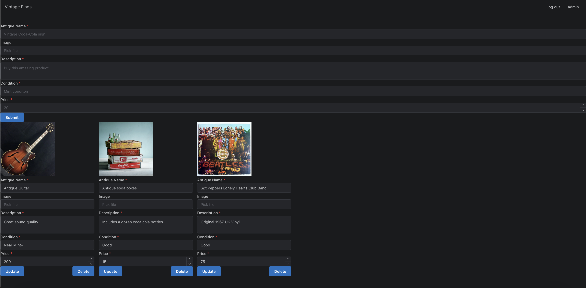

# Vintage Finds

Vintage Finds is a web platform designed for antique enthusiasts and collectors. The website allows an admin to post various antique items with details such as name, image, description, condition, and price. Users can browse through a curated selection of antiques, offering them a glance into the past and the opportunity to purchase unique items.

## Features

- **Admin Access**: Secure admin access to post new antique items.
- **User View**: A clean and intuitive interface for users to view antique items.
- **Image Upload**: Admins can upload images to visually represent each antique.
- **Detailed Descriptions**: Each item comes with a detailed description and condition report.
- **Pricing Information**: Visible pricing to inform potential buyers.

## Tech Stack

- **Frontend**: Next.js
- **Database**: Google's Relational Database
- **Styling**: Custom CSS / Styled Components and the Mantine React.js library
