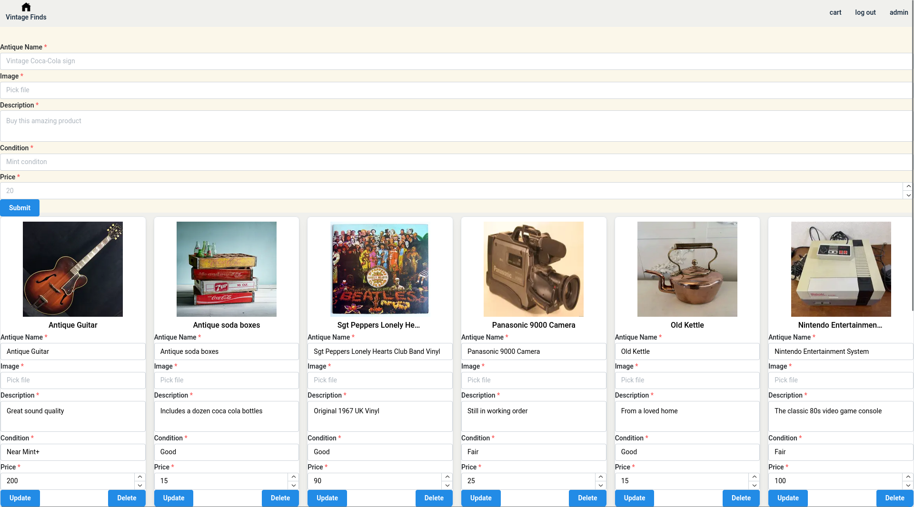
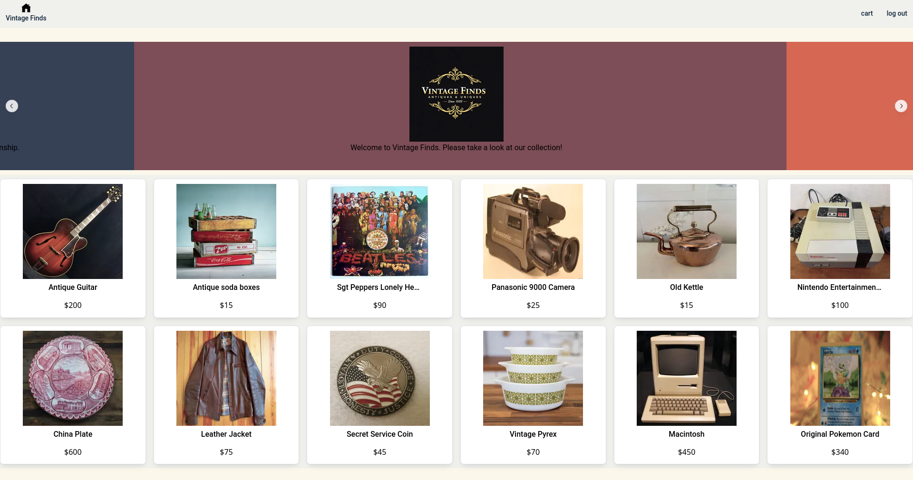

# 🏺 Vintage Finds

**Vintage Finds** is a full-stack web platform for antique enthusiasts and collectors.  
Built with **Next.js** and **Firebase**, it provides an elegant user interface for browsing antiques and a secure admin dashboard for managing inventory in real time.

## ✨ Overview

Vintage Finds was developed as a modern digital storefront for a local antique business, combining timeless aesthetics with responsive, real-time technology.

The app enables an **admin user** to post and manage antique listings, while **visitors** can browse items complete with photos, descriptions, and condition reports. All data and images are stored securely in **Firebase Realtime Database** and **Firebase Storage**.

## 🚀 Features

### 🧑‍💼 Admin Dashboard

The owner of this hypothetical business would be able to login and have immediate access to this Admin page. In this situation, the buisiness owner wouldn't need to know how Google Firebase or how to program. They could simply upload and edit their listings on the website itself.

- Secure authentication via **Firebase Auth**
- Add, edit, and delete antique listings
- Upload and replace item images stored in **Firebase Storage**
- Real-time updates that sync instantly to the public storefront

### 🛍️ User Experience
- Clean interface built with **Mantine UI**
- Real-time inventory display with pricing and condition details. Customers can see exactly what the owner has in stock this way.
- “Favorites” and “Cart” features under active development

## 🧰 Tech Stack

| Layer | Technology |
|-------|-------------|
| **Frontend** | Next.js (React, TypeScript) |
| **UI Library** | Mantine UI & Styled Components |
| **Database** | Firebase Realtime Database |
| **Storage** | Firebase Cloud Storage |
| **Auth** | Firebase Authentication |
| **Hosting** | Vercel |
